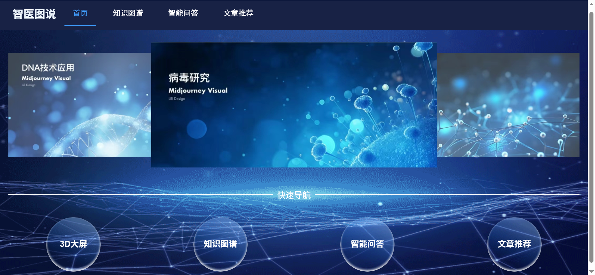
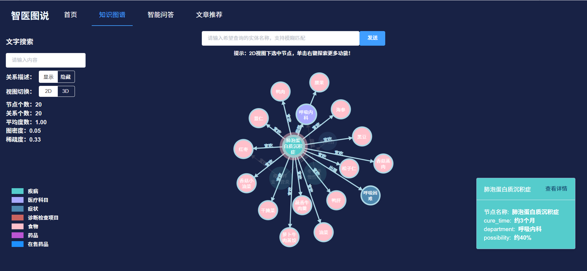
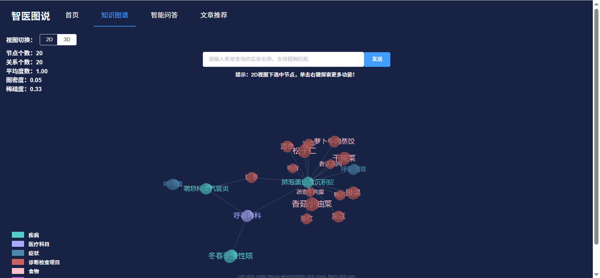
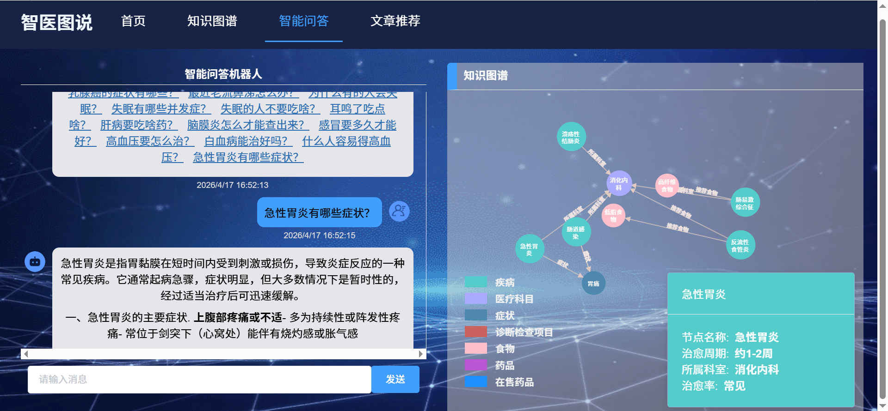
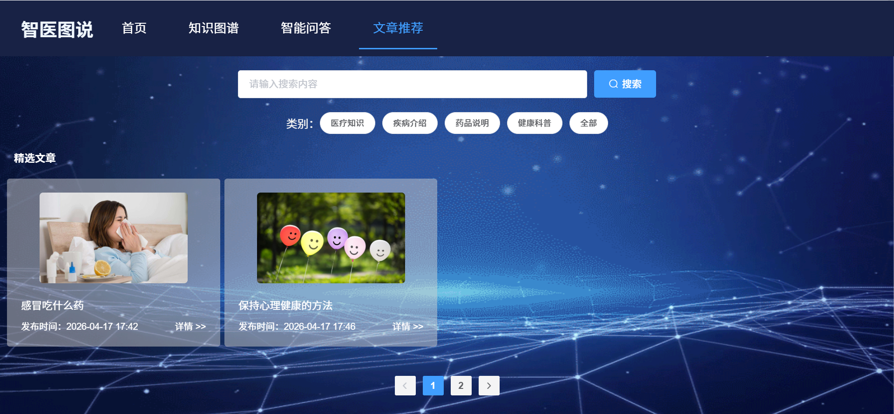

# 智医图说——结合大模型的医疗知识图谱可视化与问答系统

本仓库包含一个完整的医疗知识服务系统，包括 **前端 + 网关 + 主业务后端 + 知识图谱后端** 的全栈结构。

## 项目组成

- `medicine-kgqa`：前端项目（Vue 2）
- `medicine-gateway`：API 网关服务（Spring Cloud Gateway）
- `medicine-knowledge`：主业务后端（Spring Boot）
- `knowledge-backend`：知识图谱后端（Python Flask + Neo4j）

---

## 1. 仓库结构

```text
.
├── medicine-kgqa          # Vue 2 前端项目
├── medicine-gateway       # Spring Cloud Gateway 网关
├── medicine-knowledge     # Spring Boot 主业务服务
├── knowledge-backend      # Python Flask + Neo4j 知识图谱服务
├── screenshot             # 项目界面截图
├── README.md
└── .gitignore
```

---

## 2. 各模块职责

### 2.1 `medicine-kgqa` 前端
前端是一个 Vue 2 项目，负责：

- 用户登录、注册、重置密码
- 医疗文章浏览
- 智能问答页面
- 知识图谱 2D / 3D 可视化展示
- 图谱节点查询与图关系交互
- 调用网关与知识图谱服务接口

技术栈：

- Vue 2
- Vue Router
- Vuex
- Axios
- Element UI
- D3
- 3d-force-graph

默认开发命令：

```bash
cd medicine-kgqa
npm install
npm run serve
```
浏览器打开 http://localhost:8081/ 可看到登录页面。

---

### 2.2 `medicine-gateway` 网关
统一网关入口，负责：

- 路由转发
- 跨域处理
- 请求日志记录
- PV / UV 统计
- Redis 限流
- 给前端提供统一业务入口

---

### 2.3 `medicine-knowledge` 主业务后端
主业务服务，负责：

- 用户注册、登录、找回密码
- 文章管理
- 分类管理
- 数据统计
- OSS 上传
- 大模型问答
- SSE 流式问答

技术栈：

- Spring Boot
- Spring Security
- MyBatis-Plus
- MySQL
- Redis
- Knife4j

---

### 2.4 `knowledge-backend` 知识图谱后端
知识图谱服务，负责：

- 医疗知识图谱构建
- Neo4j 图数据库连接与查询
- 图谱节点 / 关系展示接口
- 基于规则的问句分类、解析、答案生成
- 医疗图谱问答与图谱管理接口

技术栈：

- Python
- Flask
- Neo4j
- py2neo

---

## 3. 运行环境要求

### 前端
- Node.js 16（建议）
- npm 6+

### Java 服务
- JDK 8
- Maven 3.6+

### Python 服务
- Python 3.8+
- pip

### 数据依赖
- MySQL 5.7 / 8.x
- Redis 6+
- Neo4j 4.x / 5.x

---

## 4. 本地启动顺序

建议按下面顺序启动：

1. 启动基础依赖
   - MySQL
   - Redis
   - Neo4j
2. 启动 `medicine-knowledge`
3. 启动 `medicine-gateway`
4. 启动 `knowledge-backend`
5. 启动 `medicine-kgqa`

---

## 5. 本地启动方法

### 5.1 启动 `medicine-knowledge`

```bash
cd medicine-knowledge
mvn spring-boot:run
```
---

### 5.2 启动 `medicine-gateway`

```bash
cd medicine-gateway
mvn spring-boot:run
```
---

### 5.3 启动 `knowledge-backend`

```bash
cd knowledge-backend
pip install -r requirements.txt
python back_end_server/kgserver/app.py
```
---

### 5.4 启动 `medicine-kgqa`

```bash
cd medicine-kgqa
npm install
npm run serve
```

---

## 6. 配置与密钥说明

通过环境变量或本地私有 `.env` 提供：

### medicine-knowledge

- `MAIL_USERNAME`
- `MAIL_PASSWORD`
- `REDIS_HOST`
- `REDIS_PORT`
- `REDIS_PASSWORD`
- `MYSQL_HOST`
- `MYSQL_PORT`
- `MYSQL_DATABASE`
- `MYSQL_USERNAME`
- `MYSQL_PASSWORD`
- `ALIYUN_OSS_KEYID`
- `ALIYUN_OSS_KEYSECRET`
- `ALIYUN_OSS_BUCKETNAME`
- `DASHSCOPE_API_KEY`

### knowledge-backend

- `NEO4J_HOST`
- `NEO4J_PORT`
- `NEO4J_USER`
- `NEO4J_PASSWORD`

## 7.项目截图
### 首页

### 2D知识图谱

### 3D知识图谱

### 智能问答

### 文章推荐


